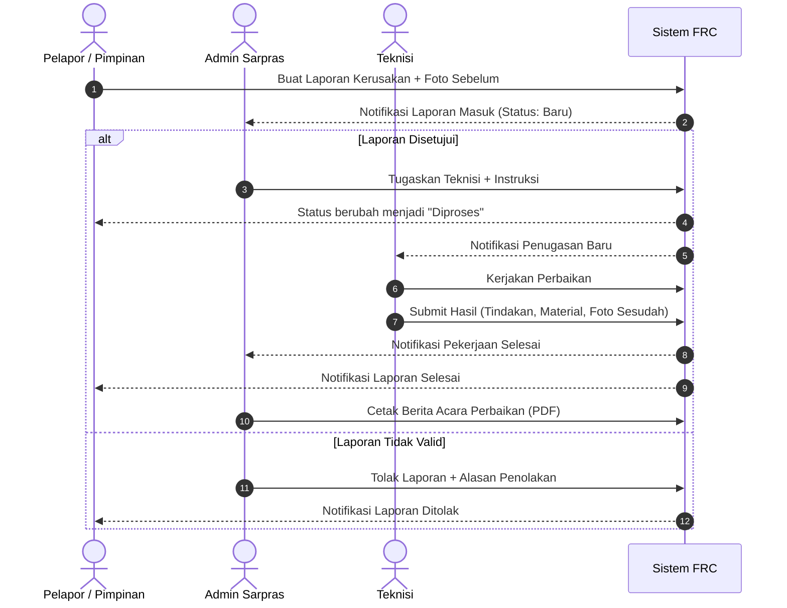

# FRC Reporting & Utility Monitoring System

[](https://laravel.com)
[](https://php.net)
[](https://tailwindcss.com)
[](https://mysql.com)
[-success?style=for-the-badge&logo=githubactions&logoColor=white)](#-menjalankan-automated-tests)

**FRC Reporting System** adalah platform web terpadu untuk **manajemen pelaporan kerusakan fasilitas (ticketing maintenance)** serta **pemantauan konsumsi utilitas energi dan air** di lingkungan **Field Research Center (FRC)** Sekolah Vokasi Universitas Gadjah Mada (UGM) di Kulon Progo.

Sistem ini dirancang untuk menggantikan pencatatan manual dan pesan instan yang tersebar menjadi satu sistem terotomasi, akuntabel, dan transparan bagi civitas kampus, teknisi, pengelola sarana prasarana, hingga jajaran pimpinan.

---

## 🚀 Fitur Unggulan

* 🛠️ **Siklus Pelaporan & Penugasan Terintegrasi:** Pelaporan kerusakan dilengkapi foto bukti awal, pemilihan 32 ruangan laboratorium/fasilitas spesifik FRC, disposisi teknisi dengan instruksi kerja, hingga form hasil perbaikan teknisi.
* 💧⚡ **Pencatatan Utilitas Gedung Terpadu:**
  * **Air:** Air Bersih ($m^3$) dan Air Hujan ($m^3$).
  * **Listrik:** MDP (*Main Distribution Panel*), SDP (*Sub Distribution Panel* 1 & 2), Lift (G & G2), AC (Lantai 1–3), dan Lampu Penerangan (Lantai 1–3).
  * Perhitungan konsumsi otomatis menggunakan *stored generated columns* pada basis data.
* 📊 **Visualisasi Grafik Interaktif:** Grafik tren konsumsi utilitas bulanan dan tahunan secara dinamis menggunakan **Chart.js**.
* 📄 **Ekspor Dokumen Resmi PDF Berwarna:**
  * Berita Acara Perbaikan Kerusakan (dilengkapi komparasi foto *before* dan *after*).
  * Rekapitulasi Laporan Masuk & Selesai (filter bulanan).
  * Laporan Rekap Konsumsi Utilitas Terpadu FRC.
* 🔔 **Sistem Notifikasi In-App Real-Time:** Peringatan otomatis untuk setiap perubahan status laporan (*Baru* $\rightarrow$ *Diproses* $\rightarrow$ *Selesai* / *Ditolak*) dengan indikator counter *unread* dan penanda sudah dibaca via AJAX.
* 🌗 **Dukungan Tema Gelap & Terang (Dark/Light Mode):** Tampilan antarmuka responsif yang nyaman digunakan di berbagai perangkat dan kondisi pencahayaan.
* 🛡️ **Keamanan Berlapis (Hardened Security):**
  * *Role-Based Access Control* (RBAC) ketat via Middleware.
  * Proteksi IDOR (*Insecure Direct Object References*) pada penyelesaian tugas teknisi.
  * Transaksi basis data atomik (`DB::transaction`).

---

## 🛠️ Tech Stack

| Layer | Teknologi |
| :--- | :--- |
| **Backend Framework** | [Laravel 12](https://laravel.com) (PHP 8.2+) |
| **Basis Data** | [MySQL](https://www.mysql.com) / [MariaDB](https://mariadb.org) (Testing: SQLite in-memory) |
| **Frontend Styling** | [Tailwind CSS](https://tailwindcss.com) & [Blade UI Kit Heroicons](https://blade-ui-kit.com) |
| **Interaktivitas Frontend** | [Alpine.js](https://alpinejs.dev) & Vanilla JavaScript |
| **Visualisasi Data** | [Chart.js](https://www.chartjs.org) |
| **PDF Reporting Engine** | [barryvdh/laravel-dompdf](https://github.com/barryvdh/laravel-dompdf) |
| **Autentikasi** | [Laravel Breeze](https://laravel.com/docs/10.x/starter-kits#laravel-breeze) |
| **Asset Bundler** | [Vite](https://vitejs.dev) |

---

## 👥 Peran Pengguna & Alur Kerja

Aplikasi mengimplementasikan **Role-Based Access Control (RBAC)** dengan 4 jenis peran:



### Rincian Tanggung Jawab Role:
1. **Pelapor (Dosen, Mahasiswa, Staf Umum):**
   * Mengisi formulir laporan kerusakan sarpras dengan foto bukti awal.
   * Memilih nama ruangan spesifik dari master data 32 ruangan/laboratorium FRC.
   * Melacak status pengerjaan tiket dan menerima notifikasi penyelesaian.
2. **Admin (Pengelola Operasional & Sarpras):**
   * Pusat kendali operasional, verifikasi laporan masuk, dan disposisi teknisi.
   * Penolakan laporan jika duplikat atau tidak relevan disertai alasan resmi.
   * Pencatatan meteran berkala (Air & Listrik) seluruh fasilitas gedung.
   * Pengelolaan akun pengguna (tambah user & toggle aktivasi status akun).
   * Cetak rekapitulasi laporan dan berita acara PDF.
3. **Teknisi (Tim Pemeliharaan / Maintenance):**
   * Menerima daftar penugasan aktif beserta instruksi khusus dari Admin.
   * Memperbarui pengerjaan dan mengisi form penyelesaian (tindakan, material yang digunakan, serta unggah foto sesudah perbaikan).
   * Melihat riwayat perbaikan yang telah diselesaikan.
4. **Kepala FRC (Pimpinan / Eksekutif):**
   * Memantau KPI operasional (laporan masuk, berjalan, selesai).
   * Memantau metrik produktivitas dan ranking kinerja teknisi.
   * Mengamati grafik tren dan rekap utilitas bulanan/tahunan gedung FRC.
   * Mengunduh rekapitulasi utilitas dan laporan kerusakan terpadu (PDF).
   * Fasilitas pembuatan laporan langsung jika menemukan kerusakan.

---

## 🔑 Akun Demo Seeder

Semua akun dummy berikut telah disediakan secara otomatis oleh database seeder dengan **password seragam**: `password123`

| Peran (Role) | Nama Lengkap | Email Akun | Password |
| :--- | :--- | :--- | :--- |
| **Admin** | Ari Kustanto | `admin@frc.com` | `password123` |
| **Kepala FRC** | Pimpinan FRC | `kepala@frc.com` | `password123` |
| **Teknisi (Listrik)** | Budi Teknisi (Listrik) | `teknisi1@frc.com` | `password123` |
| **Teknisi (Air & AC)** | Joko Teknisi (Air & AC) | `teknisi2@frc.com` | `password123` |
| **Pelapor 1** | Rahayu | `pelapor1@frc.com` | `password123` |
| **Pelapor 2** | Jono | `pelapor2@frc.com` | `password123` |
| **Pelapor 3** | Keling | `pelapor3@frc.com` | `password123` |

---

## 💻 Panduan Instalasi Lokal

Ikuti langkah-langkah berikut untuk menjalankan project di komputer lokal:

### 1. Prasyarat Sistem
* PHP $\ge$ 8.1 dengan ekstensi `pdo`, `pdo_mysql`, `gd`, `fileinfo`, `mbstring`.
* Composer $\ge$ 2.x
* Node.js $\ge$ 18.x & NPM
* Server MySQL / MariaDB (misal via Laragon, XAMPP, atau Docker)

### 2. Kloning Repositori
```bash
git clone https://github.com/nasjiarr/frc-reporting-system.git
cd frc-reporting-system
```

### 3. Instal Dependensi Backend & Frontend
```bash
# Instal paket PHP via Composer
composer install

# Instal dependensi JavaScript via NPM
npm install
```

### 4. Konfigurasi Environment (`.env`)
Salin file `.env.example` menjadi `.env` lalu generate application key:
```bash
cp .env.example .env
php artisan key:generate
```

Buka file `.env` dan sesuaikan koneksi database Anda:
```env
DB_CONNECTION=mysql
DB_HOST=127.0.0.1
DB_PORT=3306
DB_DATABASE=frc_reporting
DB_USERNAME=root
DB_PASSWORD=
```
*(Pastikan basis data `frc_reporting` sudah dibuat di MySQL Anda).*

### 5. Jalankan Migrasi & Seeder Database
Eksekusi migrasi tabel beserta data demo bawaan (akun pengguna, dummy laporan, dummy penugasan, dan data utilitas):
```bash
php artisan migrate --seed
```

### 6. Hubungkan Symlink Storage (Penting)
Agar foto bukti kerusakan awal dan foto hasil perbaikan teknisi dapat tampil di browser dan dokumen PDF:
```bash
php artisan storage:link
```

### 7. Jalankan Server Aplikasi
Jalankan dev server Laravel dan Vite asset compiler pada 2 terminal terpisah:

**Terminal 1 (Laravel Server):**
```bash
php artisan serve
```

**Terminal 2 (Vite Compiler):**
```bash
npm run dev
```

Aplikasi sekarang dapat diakses melalui browser di: **`http://localhost:8000`**

---

## 🧪 Menjalankan Automated Tests

Aplikasi dilengkapi pengujian unit & feature test komprehensif menggunakan **PHPUnit** dengan koneksi basis data SQLite in-memory:

```bash
# Menjalankan seluruh test suite
php artisan test

# Menjalankan test alur pelaporan end-to-end secara spesifik
php artisan test --filter=LaporanWorkflowTest
```

Cakupan pengujian otomatis [LaporanWorkflowTest](tests/Feature/LaporanWorkflowTest.php):
* ✅ Validasi pembuatan laporan baru oleh Pelapor (status awal `Baru`).
* ✅ Validasi penugasan teknisi oleh Admin (status berubah `Diproses` & tiket penugasan tercatat).
* ✅ Validasi penyelesaian tugas oleh Teknisi (unggah bukti foto & status menjadi `Selesai`).
* ✅ Validasi proteksi anti-IDOR (teknisi dilarang menyelesaikan tugas milik teknisi lain).
* ✅ Validasi otorisasi RBAC (role non-admin diblokir dengan kode HTTP 403 saat mengakses rute admin).

---

## 🏛️ Master Lokasi Gedung FRC

Daftar master ruangan FRC UGM dikelola secara terpusat pada file konfigurasi [`config/frc.php`](config/frc.php), mencakup laboratorium produksi terapan seperti:
* *Wood pellet production laboratory*
* *Cocoa production & packaging laboratory*
* *Dairy production & packaging laboratory*
* *Patient simulators & phantoms for medical nursing production*
* *Product analysis & quality control laboratory*
* *Incubation & Design Room 1–4, IT Design Room*
* *Showroom, Conference Room, Seminar Rooms, Mushola, Panel Room, dsb.*

---

## 📄 Lisensi

Project ini dikembangkan di bawah lisensi open-source [MIT License](LICENSE).
